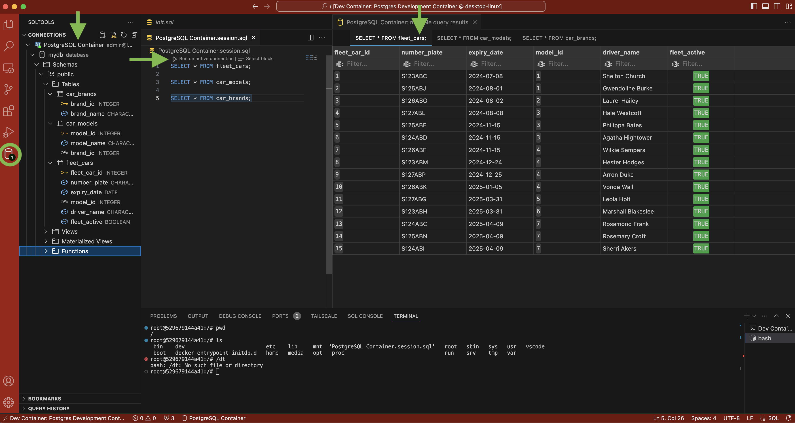

# gdp-car-rego-database

This repository contains the database code for the Car Registration Tracker project.

## Starting the Dev Container

Open VSCode Command Palette (F1) and select:

-   `Dev Container: Reopen in Container`
-   OR
-   `Dev Container: Rebuild Without Cache and Reopen in Container`

## Test database

Once the devcontainer is open.

select:

-   SQLTools extension icon (left sidebar)
-   conections > postgreSQL container

```sql
-- Query the table to verify the data
SELECT * FROM fleet_cars;
SELECT * FROM car_models;
SELECT * FROM car_brands;
```


