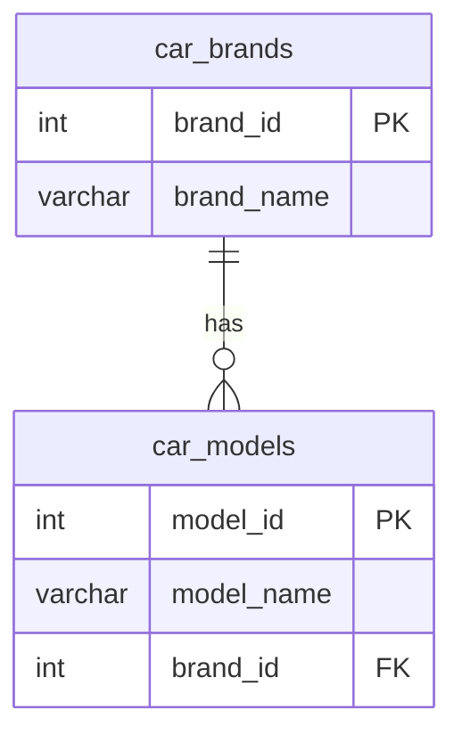
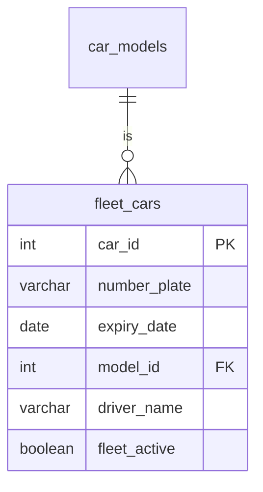

# Fleet Management Database

This document contains a comprehensive explanation of the database schema, including tables, relationships, and constraints, and it also includes visual representations using Mermaid diagrams.

The database is created to effectively manage a business's fleet of cars, ensuring that users can track all vehicle registration statuses based on expiry dates. This allows the company to ensure active fleet cars comply with the law. It allows users to add, modify, and remove vehicles from the fleet.

## Database Schema

The database schema consists of the following tables:

1. **car_brands**: Stores information about car brands.
2. **car_models**: Stores information about car models associated with specific brands.
3. **fleet_cars**: Stores information associated with cars, including but not limited to the active status of a car.

### Tables

#### car_brands

| Column     | Type    | Constraints      |
| ---------- | ------- | ---------------- |
| brand_id   | SERIAL  | PRIMARY KEY      |
| brand_name | VARCHAR | NOT NULL, UNIQUE |

#### car_models

| Column     | Type    | Constraints                        |
| ---------- | ------- | ---------------------------------- |
| model_id   | SERIAL  | PRIMARY KEY                        |
| model_name | VARCHAR | NOT NULL                           |
| brand_id   | INT     | NOT NULL, FOREIGN KEY (car_brands) |

#### fleet_cars

| Column       | Type    | Constraints                        |
| ------------ | ------- | ---------------------------------- |
| car_id       | SERIAL  | PRIMARY KEY                        |
| number_plate | VARCHAR | NOT NULL, UNIQUE                   |
| expiry_date  | DATE    | NOT NULL                           |
| model_id     | INT     | NOT NULL, FOREIGN KEY (car_models) |
| driver_name  | VARCHAR | NOT NULL                           |
| fleet_active | BOOLEAN | DEFAULT TRUE                       |

### Relationships and Constraints

-   Each car brand can have multiple models.
-   Each car model is associated with a single car brand.
-   The `fleet_cars` table stores both active and inactive cars in the fleet. The `fleet_active` flag indicates whether a car is active in the fleet.

### ER Diagrams

#### Car Brands and Car Models Relationship

**Description:** The `car_brands` table has a one-to-many relationship with the `car_models` table, meaning each `car_brands` can have multiple `car_models`.

#### Fleet Cars Table

**Description:** The `fleet_cars` table stores information about cars in the fleet, both active and inactive. The `fleet_active` field indicates whether a car is currently active in the fleet. The `car_models` table has a one-to-many relationship with the `fleet_cars` table.

## Usage

### Adding a New Car to the Fleet

To add a new car to the fleet, insert a record into the `fleet_cars` table. Ensure that the `model_id` corresponds to an existing model in the `car_models` table.

### Removing a Car from the Fleet

To remove a car from the fleet, update the `fleet_active` field in the `fleet_cars` table to `FALSE`.

### Ensuring Data Integrity

-   Use foreign key constraints to ensure that each car model is associated with a valid car brand.
-   Ensure that `number_plate` values are unique across the `fleet_cars` table to avoid duplication.

## Initial Data

The initial data includes records for car brands, car models, and fleet cars. Here is the sample data used to populate the tables:

### car_brands

| brand_id | brand_name |
| -------- | ---------- |
| 1        | Toyota     |
| 2        | Ford       |
| 3        | Hyundai    |

### car_models

| model_id | model_name  | brand_id |
| -------- | ----------- | -------- |
| 1        | Landcruiser | 1        |
| 2        | Yaris       | 1        |
| 3        | RAV4        | 1        |
| 4        | Ranger      | 2        |
| 5        | Escape      | 2        |
| 6        | i30         | 3        |
| 7        | Tucson      | 3        |

### fleet_cars

| car_id | number_plate | expiry_date | model_id | driver_name        | fleet_active |
| ------ | ------------ | ----------- | -------- | ------------------ | ------------ |
| 1      | S123ABC      | 2024-07-08  | 1        | Shelton Church     | TRUE         |
| 2      | S125ABJ      | 2024-08-01  | 1        | Gwendoline Burke   | TRUE         |
| 3      | S126ABO      | 2024-08-02  | 2        | Laurel Hailey      | TRUE         |
| 4      | S127ABL      | 2024-08-08  | 3        | Hale Westcott      | TRUE         |
| 5      | S125ABE      | 2024-11-15  | 3        | Philippa Bates     | TRUE         |
| 6      | S124ABD      | 2024-11-15  | 3        | Agatha Hightower   | TRUE         |
| 7      | S126ABF      | 2024-11-15  | 4        | Wilkie Sempers     | TRUE         |
| 8      | S123ABM      | 2024-12-24  | 4        | Hester Hodges      | TRUE         |
| 9      | S127ABP      | 2024-12-25  | 4        | Arron Duke         | TRUE         |
| 10     | S126ABK      | 2025-01-05  | 4        | Vonda Wall         | TRUE         |
| 11     | S127ABG      | 2025-03-31  | 5        | Leola Holt         | TRUE         |
| 12     | S123ABH      | 2025-03-31  | 6        | Marshall Blakeslee | TRUE         |
| 13     | S124ABC      | 2025-04-09  | 7        | Rosamond Frank     | TRUE         |
| 14     | S125ABN      | 2025-04-09  | 7        | Rosemary Croft     | TRUE         |
| 15     | S124ABI      | 2025-04-09  | 7        | Sherri Akers       | TRUE         |
